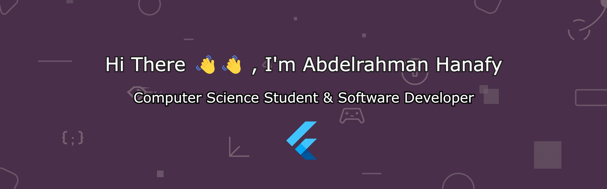

# About
I'm a passionate Egyptian CS student at the German University in Cairo (GUC), just finished my 6th semester and eager to learn new things and gain experience.

Here you can [view my resume.](https://drive.google.com/file/d/1b1opf_Qme0M6U_uOc8KWCCI8vJ9Jht89/view?usp=sharing)

Currently I'm :-
- Working on enhancing my problem solving skills.
- Working on improving my Flutter development skills by implementing beautiful UIs.

# Connect with me

> **_NOTE:_**  You can send me an email using the Gmail icon or using [abdelrahmanhanafydev@gmail.com](mailto:abdelrahmanhanafydev@gmail.com).

# Programing languages I learned
-  Python.
-  JavaScript.
-  Dart.
-  Java.
-  C#.
-  Haskell.

<!--
**Abdelrahman-Hanafy-Dev/Abdelrahman-Hanafy-Dev** is a ✨ _special_ ✨ repository because its `README.md` (this file) appears on your GitHub profile.

Here are some ideas to get you started:

- 🔭 I’m currently working on ...
- 🌱 I’m currently learning ...
- 👯 I’m looking to collaborate on ...
- 🤔 I’m looking for help with ...
- 💬 Ask me about ...
- 📫 How to reach me: ...
- 😄 Pronouns: ...
- ⚡ Fun fact: ...
-->
